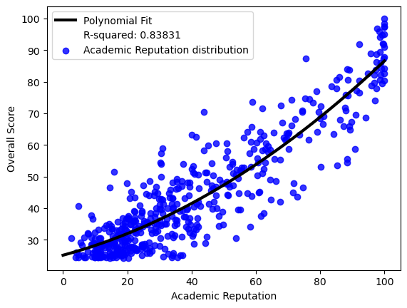
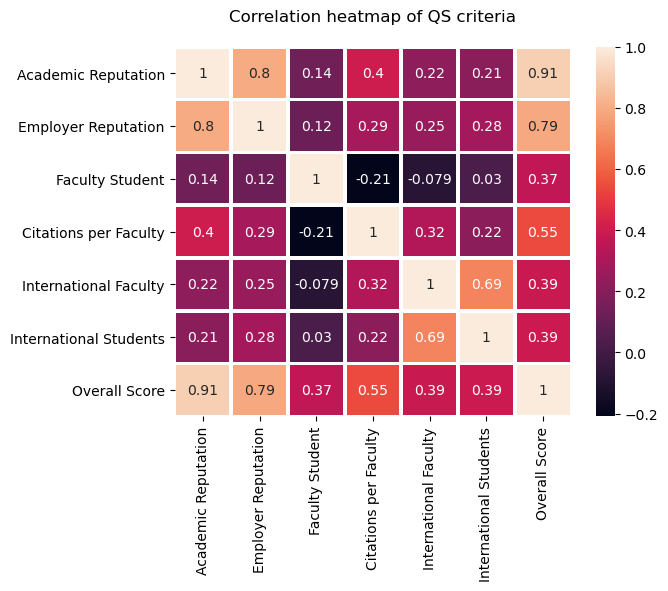
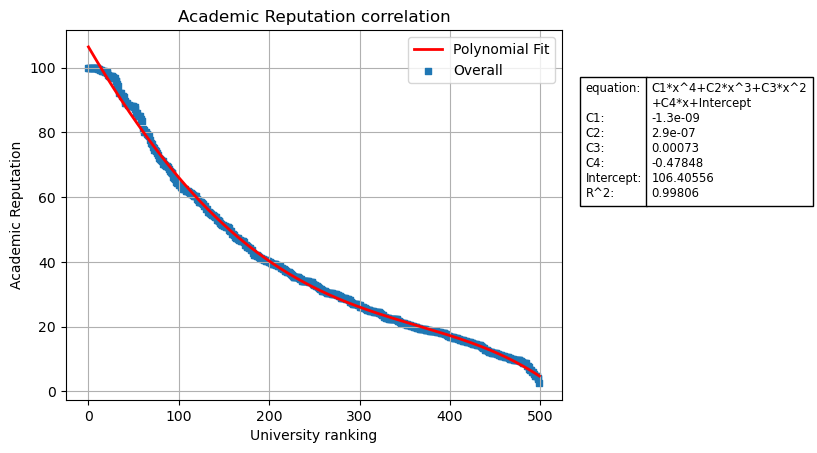
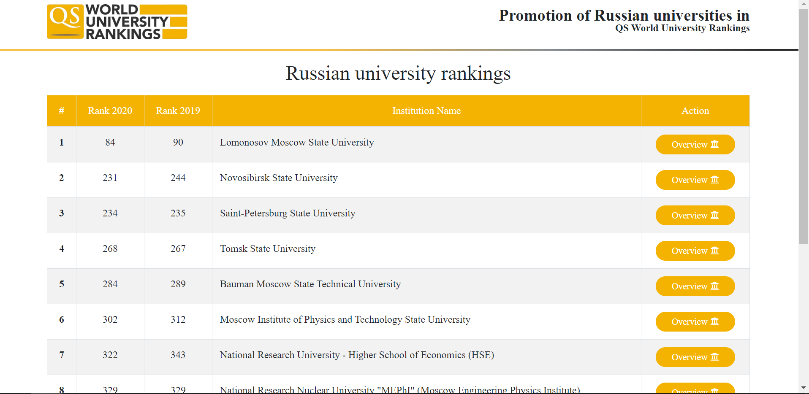
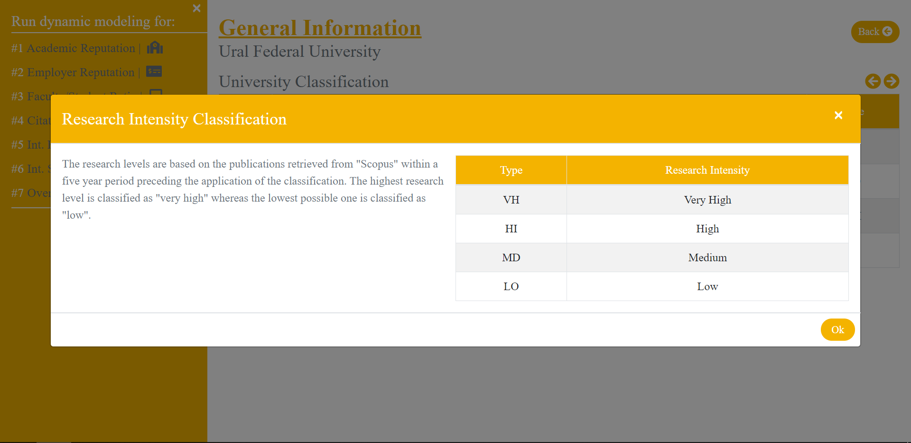
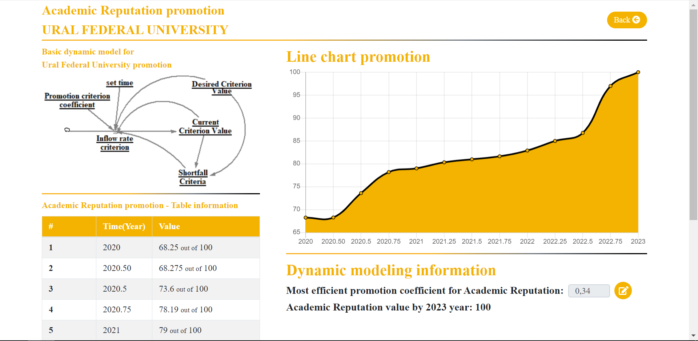

# Analysis and promotion modeling of Russian universities in the QS World Universities Rankings
This repository is devoted to my bachelor's thesis about the promotion of Russian universities in QS Rankings.
The practical part consists of two separate parts.
The first part is the statistical analysis of QS to define crucial metrics and variables of this rankings for further promotion.
The second part is the dynamical modeling web-application of ten-top Russian universities in QS.
Below it is said im more detail about each application

## Statistical Analysis
Statistical analysis of QS rankings was done in Python using the library "matblotlib" to save data in a graphical way.
To conduct statistical analysis, it was applied concepts of statistics.
Below there are some charts are represented as a result of this script (all images are represented in the folder named 'images/second chapter')
## Statistical analysis (some photos)
Regression analysis example

Correlation analysis example

Overall correlation example

##Dynamical modeling promotion of Russian universities web-application
This part of the thesis is devoted to developing a web-application allowing to promote a university in QS World University Ranking by Overall Score as well as by each separate criterion.
Angular is used to develop a client-side app.
Spring is used to develop a server.
PostgreSQL is chosen to keep and operate with data.

There are some screenshots of the web-app belo.

##Dynamical modeling (client-side view)
<b>Home page screenshot example</b>

<b>General information about a university example</b>

<b>Dynamic modeling promotion example<b>

## Further help
If you have any question regarding this project, do not hesitate to contact me via e-mail 'antonskripin@gmail.com'
